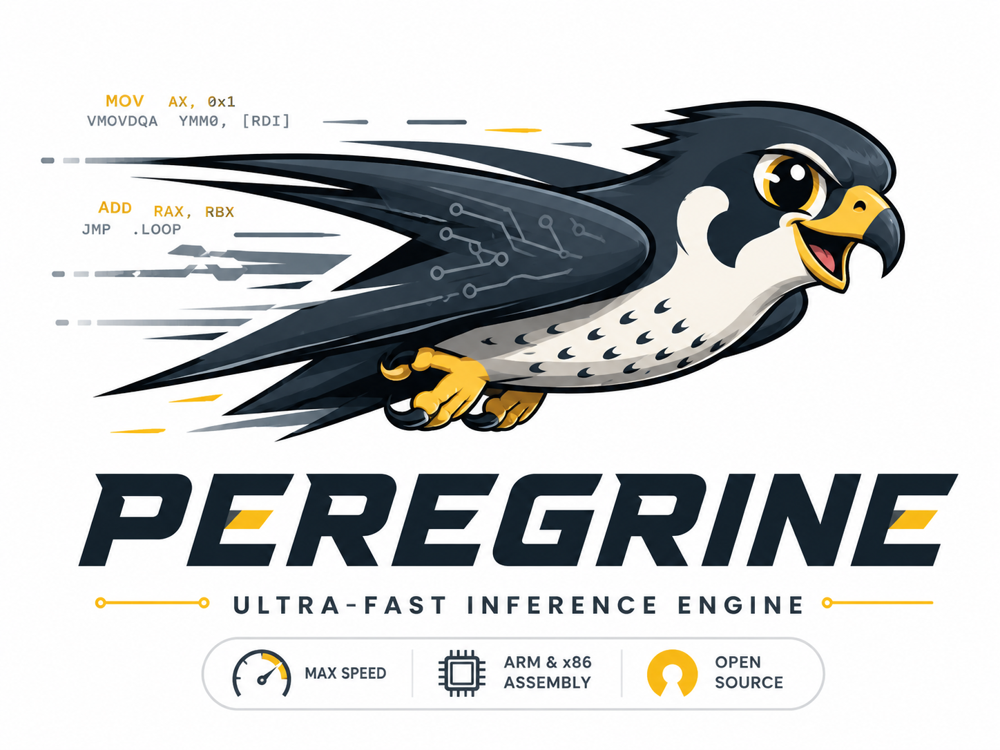

<p align="center">
  
</p>

<h1 align="center">Peregrine</h1>

<p align="center">
  An inference engine for CPUs, written in C with hand-written assembly.
  Think FFmpeg, but for running models.
</p>

<p align="center">
  <a href="https://github.com/WorldFlowAI/peregrine/actions/workflows/ci.yml">
    
  </a>
  
  
</p>

Status: pre-alpha. What runs today is the kernel foundation: runtime CPU
detection and dispatch, the checkasm test harness (fuzzing, register-clobber
checks, and benchmarks), and the first few kernels (`dot`, `axpy`, `rmsnorm`).
All of it is green in CI on x86-64 and ARM. The actual inference engine, meaning
model loading, the tokenizer, and the decode loop, is still ahead of us. See the
[roadmap](ROADMAP.md). The name is a placeholder for now.

## Why build this

`llama.cpp` made local inference easy, and it gets its speed from compiler
intrinsics. Peregrine takes the route FFmpeg and dav1d take instead. Every
operation has a plain C version, and the parts that matter for speed are written
in assembly by hand, one version per instruction set, chosen at runtime based on
what the CPU actually supports.

There are no intrinsics in the kernels. That is a deliberate choice: it means
register allocation and instruction scheduling are ours to decide rather than
the compiler's, which is where the last chunk of performance usually hides. The
C version always works and runs anywhere, and it is the reference that every
assembly version gets tested against.

For the full picture, see [ARCHITECTURE.md](ARCHITECTURE.md).

## Quick start

You only need a C compiler.

```sh
make -f Makefile.bootstrap test
```

This builds one kernel (`dot_f32`: the C reference plus whichever assembly
matches your machine, NEON on ARM or AVX2 on x86) and runs the checkasm harness,
which fuzzes the assembly against the C reference and then times it. On an Apple
Silicon Mac you get something like:

```
peregrine checkasm: dot_f32
  cpu flags: neon
  n=16       ref=-0.32910      simd=-0.32910      ok
  ...
  throughput: 22.16 GFLOP/s  (0.095 ms/call, n=1048576)
CHECKASM: PASS
```

The CLI builds the same way:

```sh
make -f Makefile.bootstrap peregrine && ./peregrine info
```

## Building with Meson

Meson is the real build. The bootstrap Makefile above is just a zero-dependency
shortcut for the host architecture.

```sh
meson setup build && meson compile -C build && meson test -C build
./build/tests/checkasm --bench        # throughput tables, off by default
```

You need NASM for the x86-64 assembly. On ARM the `.S` files go through the C
compiler, so there is nothing extra to install.

One thing to watch on Apple Silicon: Meson picks the target architecture from
the Python it runs under, not from the machine. If your `python3` came from
pyenv or Homebrew and was built for x86-64 (so it runs under Rosetta), Meson
will think the host is x86-64, print `cpu family: x86_64`, and produce an x86
binary. Run Meson from a native arm64 Python to avoid that:

```sh
/usr/bin/python3 -m pip install --user meson
/usr/bin/python3 -m mesonbuild.mesonmain setup build
```

The bootstrap Makefile keys off `uname -m`, so it always builds for the real
host and sidesteps this entirely.

## Layout

```
include/peregrine/    public C API (pg_ prefix)
src/util/             CPU detection, aligned allocation
src/tensor/kernels/   the kernels: a C reference plus per-ISA assembly, and the dispatch
src/ext/              vendored assembly macro layers (x86inc.asm, dav1d asm.S)
tests/checkasm/       correctness fuzzing, register-clobber checks, benchmarks
src/graph/ model/ token/ cli/   engine, loaders, tokenizer, CLI (planned)
```

## Contributing

Adding a kernel and the testing it has to pass are written up in
[CONTRIBUTING.md](CONTRIBUTING.md) and [doc/writing-asm.md](doc/writing-asm.md).
The quickest way in is to copy `src/tensor/kernels/dot/` and follow the same
shape: a C reference, the assembly, a dispatch table, and a checkasm entry.

## License

BSD-2-Clause, see [LICENSE](LICENSE). The vendored assembly macro layers keep
their own upstream licenses; see [THIRD_PARTY_LICENSES.md](THIRD_PARTY_LICENSES.md).
